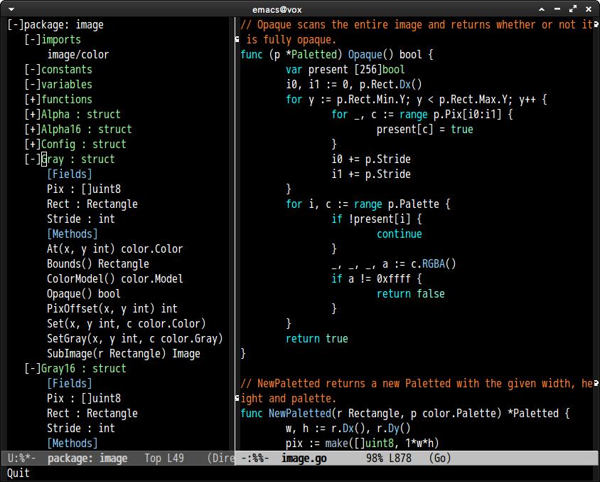
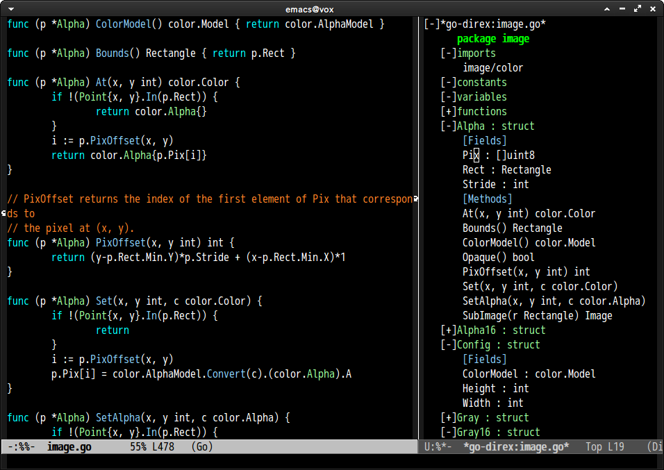

# go-direx.el

## Introduction

You can view go code in a tree style viewer with `direx.el`.


## Screenshot




## Dependency

* [direx](https://github.com/m2ym/direx-el)
* [gotags](https://github.com/jstemmer/gotags)

You can install `direx` with package.el from MELPA.
And you can install `gotags` by `go get` as below.

```
% go get -u github.com/jstemmer/gotags
```


## Setup

```lisp
(require 'go-direx) ;; Don't need to require, if you install by package.el
(define-key go-mode-map (kbd "C-c C-j") 'go-direx-pop-to-buffer)
```

### Working with [popwin](https://github.com/m2ym/popwin-el)

```lisp
(require 'popwin)
(setq display-buffer-function 'popwin:display-buffer)

(push '("^\*go-direx:" :regexp t :position left :width 0.4 :dedicated t :stick t)
      popwin:special-display-config)
```

#### Show buffer on right side



```lisp
(push '("^\*go-direx:" :regexp t :position right :width 0.4 :dedicated t :stick t)
      popwin:special-display-config)
```
